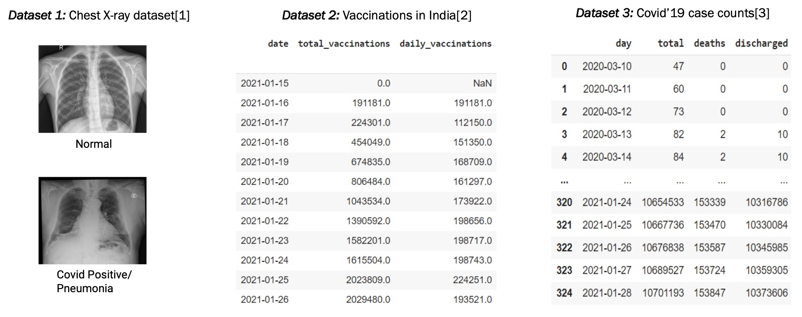
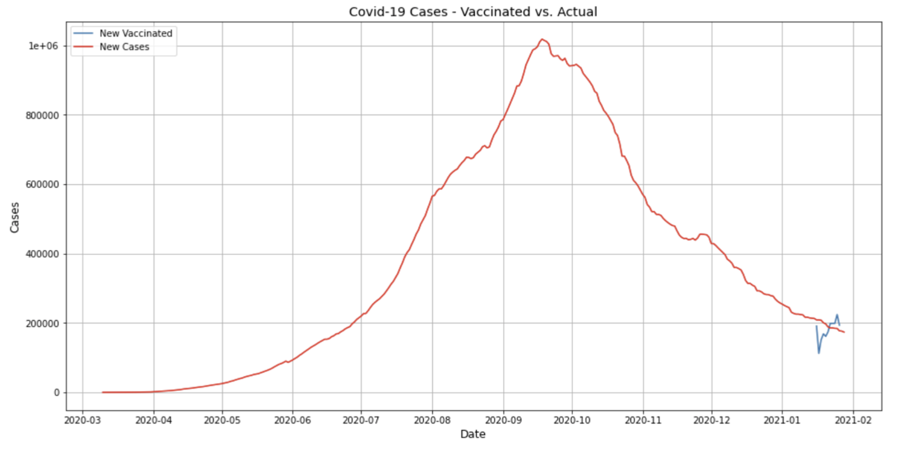
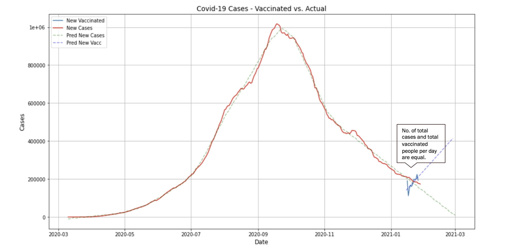
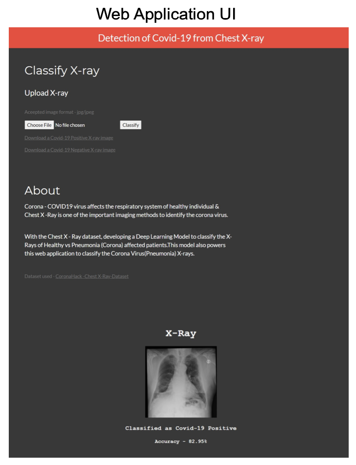

# Covid19 Detection, Vaccination and Analysis

## Introduction

- This project is divided into 2 parts
  1. Pneumonia detection from lung x-rays: COVID19 virus affects the respiratory system of healthy individual & Chest X-Ray is one of the important imaging methods      to identify Pneumonia caused due to corona virus. With the Chest X - Ray dataset, developed a Deep Learning Model to classify the X-Rays of Healthy vs              Pneumonia (Corona) affected patients.
  2. Monitoring the progress of Vaccination: Monitoring and comparing and forecasting the progress of Vaccination with the COVID19 cases per day.

- This model also powers a web application to classify the Corona Virus (Pneumonia) X-rays.

## Datasets Used

## X-Ray Classification
**Classification Model**:
- Input Data :
  80-20 split
  Augmented - rescale the image 1./255, rotate by 90 degrees, shift width and height by 0.15,flip horizontally, zoom by 0.5.

- Convolutional neural network :
  4 Conv layers with 3x3 strides, ReLU Non-Linearity , Max Pooling, Batch Normalization 4 Dense Layers with Dropout
  Softmax layer
  
## Diagram: Graph showing new Covid'19 cases and the vaccinated cases

## Diagram: Graph showing prediction of Covid'19 cases and tha vaccinated cases till March

## How is this innovative
- This Model is inspired by the famous AlexNet [4] and the FastRCN [5] paper.
- The inputs are 224x224 images, which are passed through a total of four convolution layers, then flattened for classification.
- This model powers a web application to classify the Corona Virus(Pneumonia) X-rays.

## Conclusion
- According to current situation (28/01/2021 - India), vaccination is provided to approx 2 lakh people per day. If we go in accordance with this, then it would take around 19 years to vaccinate 136 crore people.
- Our future work would include:
  - Get more data
  - Improve model accuracy
  - Refresh the front-end design
  - Deploy the pneumonia detection model on heroku

## References
1. Chest X-Ray: https://www.kaggle.com/praveengovi/coronahack-chest-xraydataset.
2. Vaccination Dataset: https://ourworldindia.org/
3. Covid Data: https://api.rootnet.in/
4. https://proceedings.neurips.cc/paper/2012/hash/c399862d3b9d6b76c8436e924a68c45b-Abstract.html
5. https://arxiv.org/abs/1504.08083v2
